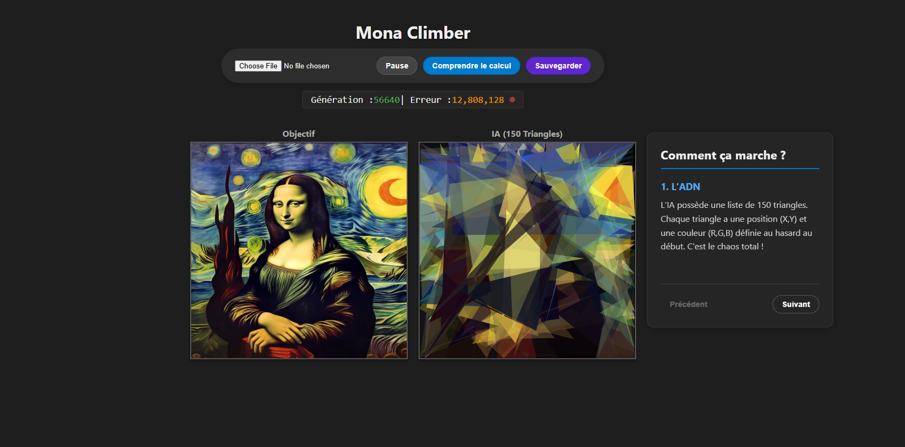

# Mona Climber

A genetic algorithm that recreates images using 150 triangles.

## 🎨 Demo



*The algorithm recreating your image with 150 triangles*

## 📖 Description

Mona Climber uses a genetic algorithm to recreate any image using only 150 colored triangles. The program evolves generation after generation, progressively improving its reproduction of the target image.

## 🚀 Installation

```bash
# Clone the repository
git clone https://github.com/GuiFraV/Mona-Climber.git

# Install dependencies
npm install

# Run in development mode
npm run dev

# Build for production
npm run build
```

## 🎮 Usage

1. Open the application in your browser
2. Click "Choose File" to load your image
3. The algorithm starts automatically
4. Use the buttons to:
   - **Pause/Resume**: Control the evolution
   - **Understand the calculation**: See how the algorithm works pixel by pixel
   - **Save**: Export your creation

## 💡 How it Works

### 1. The DNA
The AI has a list of 150 triangles. Each triangle has a position (X,Y) and a color (R,G,B) randomly defined at the start.

### 2. Mutation
60 times per second, the AI copies its current drawing and slightly modifies one detail: it moves a point or changes a color shade.

### 3. Natural Selection
We compare the new drawing with the target. If the mathematical error decreases, we keep the mutation. Otherwise, we discard it and try again.

### 4. Evolution
It's the same logic as Darwin's biological evolution, but accelerated millions of times by your processor to create art.

## 🎓 Inspiration

This project is inspired by pioneering works in generative art:
- [**Evolution of Mona Lisa**](https://rogerjohansson.blog/2008/12/07/genetic-programming-evolution-of-mona-lisa/) by Roger Alsing (2008)
- [**Genetic Lisa**](https://peterbraden.github.io/genetic-lisa/) by Peter Braden

## 👤 Author

**GuiFraV**
- GitHub: [@GuiFraV](https://github.com/GuiFraV)
- Project: [Mona Climber](https://github.com/GuiFraV/Mona-Climber)

## 📄 License

MIT © 2024 GuiFraV - See the [LICENSE](LICENSE) file for details.

---

⭐ If you like this project, don't hesitate to give it a star on GitHub!